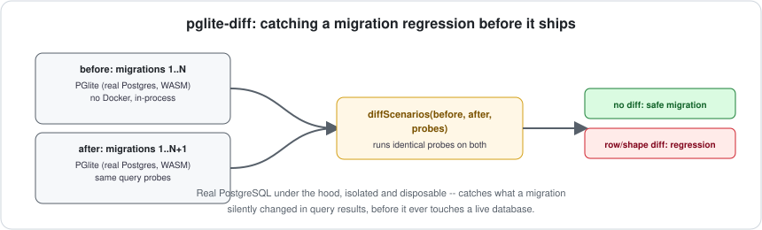

# pglite-diff

[](https://github.com/jayblast-spec/pglite-diff/actions/workflows/ci.yml)
[](https://www.npmjs.com/package/pglite-diff)
[](./LICENSE)
[](https://pglite-diff.vercel.app)



**Runs the same query probes against two SQL setups (e.g. two versions of a migration) on isolated in-memory Postgres instances and reports exactly what differs — catches migration regressions before they touch a real database.**

## The gap this fills

[PGlite](https://pglite.dev) — real PostgreSQL compiled to WASM, no Docker, no external service — has made "spin up a real Postgres in a test" fast enough to do per-test rather than per-CI-run. The pattern of using it to validate a single migration against seed data is already common. What's missing is the comparative version: when you refactor a migration history (squash old migrations, rewrite one for performance, reorder them), the risky question isn't "does the new migration run," it's **"does it produce exactly the same query-visible results as what it replaced?"** The existing open-source Postgres migration tools (Flyway, Liquibase, Atlas, Sqitch, pgroll, graphile-migrate, pgschema) all handle *applying* migrations; none of them diff two migration paths' resulting data against each other.

## What it does

```ts
import { diffScenarios } from "pglite-diff";

const report = await diffScenarios(
  { setup: originalMigrationSql },
  { setup: refactoredMigrationSql },
  [
    { name: "subscription pricing", sql: "select plan, monthly_price, annual_price from subscriptions order by id" },
    { name: "active users", sql: "select id, email from users where active order by id" },
  ]
);

if (!report.ok) {
  console.error(JSON.stringify(report, null, 2));
  process.exit(1);
}
```

Each scenario's `setup` SQL (schema + migrations + seed data, however you assemble it) runs against its own isolated in-memory PGlite instance. Every probe query then runs against both, and results are compared row-by-row, column-by-column. The report tells you exactly which probe found a difference, which row, which columns changed, and the before/after values — or, if a probe query itself fails on one side (e.g. a renamed column), that's reported distinctly rather than silently swallowed.

```
Overall: REGRESSION DETECTED

Probe "subscription pricing": MISMATCH
  row 0: changed columns [annual_price]
    before: {"plan":"starter","monthly_price":"10","annual_price":"96.0"}
    after:  {"plan":"starter","monthly_price":"10","annual_price":"108.0"}
```

## Use it as a GitHub Action or CLI

```yaml
- uses: jayblast-spec/pglite-diff@main
  with:
    config: ./pglite-diff.config.mjs
```

Or directly:

```bash
npx pglite-diff ./pglite-diff.config.mjs
```

Where the config file default-exports `{ before, after, probes }`:

```js
// pglite-diff.config.mjs
export default {
  before: { setup: `/* schema + migrations + seed data, as they are today */` },
  after:  { setup: `/* schema + migrations + seed data, after your change */` },
  probes: [
    { name: "pricing", sql: "select plan, annual_price from subscriptions order by id" },
  ],
};
```

## Install

```bash
npm install --save-dev pglite-diff @electric-sql/pglite
```

## Design notes

- **Row comparison is positional, not set-based.** A probe query without an explicit `ORDER BY` has no guaranteed row order in Postgres — write your probes with `ORDER BY` for deterministic, meaningful diffs. This is a deliberate simplicity choice, not an oversight: set-based comparison would hide genuinely meaningful ordering regressions (e.g. a broken `ORDER BY` clause) behind a false "no diff."
- **Setup failures are reported distinctly from probe failures**, naming which side (`before`/`after`) failed to even build, so a broken migration doesn't get misreported as "every probe found a difference."

## Run the demo

```bash
npx tsx examples/demo.ts
```

## Non-goals (v1)

- **Not a migration runner.** You already have one (Flyway, Atlas, Sqitch, whatever) — this only diffs the *result* of two SQL setups you provide.
- **Not schema-diffing.** It compares query results, not `information_schema` — two schemas that produce identical query results for your probes are treated as equivalent, which is usually what you actually care about.
- **Single-connection, in-process only** (a direct consequence of PGlite itself) — this is a testing tool, not a production comparison service.

## Development

```bash
npm install
npm run typecheck
npm test
npm run build
```

## License

MIT

## Part of a series

This is one of 8 independent open-source infrastructure tools, each built against a real, researched gap:

- [embedguard](https://github.com/jayblast-spec/embedguard) -- catches silent embedding-model swaps under a vector index
- [agora](https://github.com/jayblast-spec/agora) -- propose/vote/veto/quorum for multi-agent systems
- [mcp-versionbridge](https://github.com/jayblast-spec/mcp-versionbridge) -- bridges old and new MCP protocol handshakes
- [yjs-lens](https://github.com/jayblast-spec/yjs-lens) -- verifies Yjs convergence and summarizes causal history
- [gatewayproof](https://github.com/jayblast-spec/gatewayproof) -- conformance-tests OpenAI-compatible LLM gateways
- [wit-breaking](https://github.com/jayblast-spec/wit-breaking) -- detects breaking changes in WIT interfaces
- [automerge-lens](https://github.com/jayblast-spec/automerge-lens) -- explains Automerge merge conflicts and verifies convergence

---

Built by [ArkNet Digital](https://github.com/jayblast-spec).
